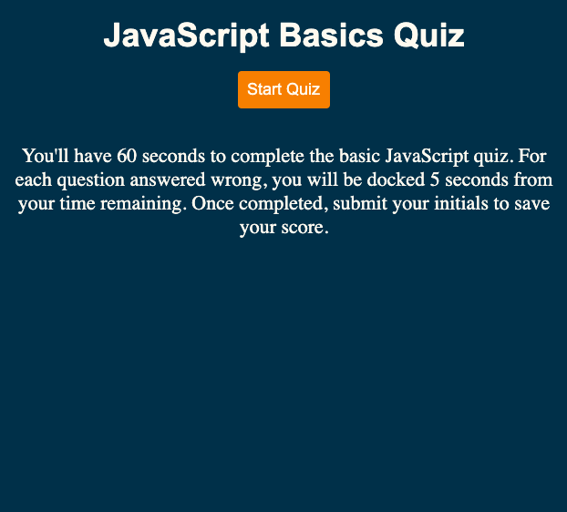
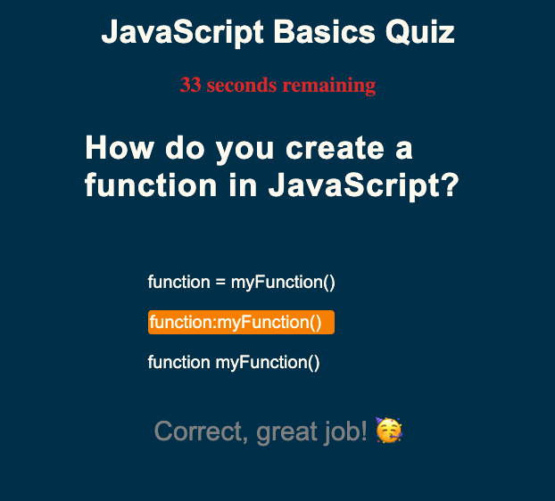
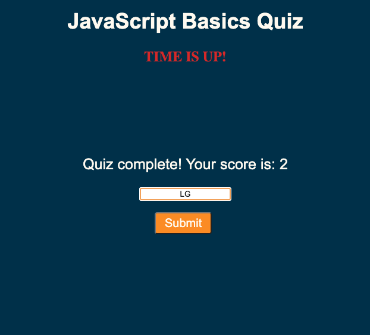

# JavaScriptQuiz

## Description

I've created a timed quiz on JavaScript basics. Participants will be asked a series of questions with a 60 second timer. For every wrong answer, 5 seconds will be taken off the clock. The quiz is over when the particpant has completed it or run out of time. The participant will be able to enter their initials next to their score and reference their past high scores. 

#### Criteria:

* Start button that initiates the quiz
* A timer that starts once the quiz is initiated and questions are shown
* Time is subtracted from the timer when the incorrect answer is chosen
* When the game is over, you can save your initials and score

### End Product 
Below are screenshots of various stages of the quiz.

<!-- screenshots -->

<!-- link -->
### Deployment
Here is the [link](https://gaughanln.github.io/password-generator/) to the live website

### Contributing
Lindsey Gaughan (Me!)
 